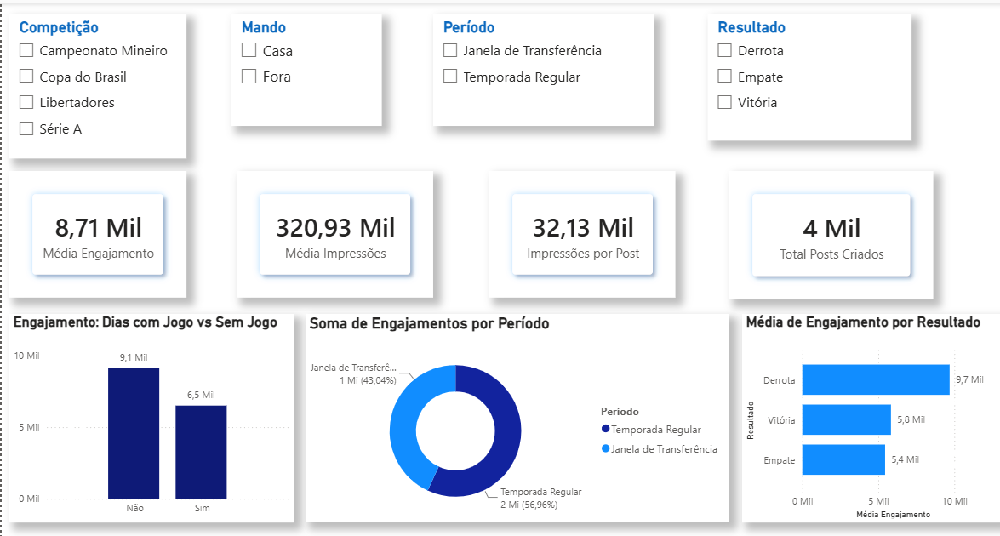

# 🦊 CEC Informs — Análise de Mídias Sociais e Desempenho em Campo

## 📌 Sobre o Projeto
Este repositório apresenta o projeto de análise de dados desenvolvido para o **CEC Informs**, cruzando métricas de engajamento e alcance do canal com o calendário, resultados das partidas e movimentações do mercado de transferências do Cruzeiro.

O objetivo foi entender como o rendimento do time e as notícias de bastidores impactam diretamente o comportamento e a interação da torcida nas redes sociais.

---

## 🖼️ Visão Geral do Painel

---

## 💡 Principais Insights Identificados

* **Cobertura Diária e Retenção:** A média de engajamento nos dias sem jogo se mantém constante, mostrando a relevância do conteúdo diário de treinos, especulações e bastidores para manter a audiência ativa.
* **Impacto do Mercado de Transferências:** A Janela de Transferências responde por cerca de **43% de todo o engajamento acumulado**, sendo um dos períodos de maior alcance orgânico do canal.
* **Reação pós-jogo:** O volume de interações varia de acordo com o resultado em campo, exigindo abordagens e postagens estratégicas dependendo do placar (vitória, empate ou derrota).

---

## 🛠️ Recursos e Estrutura Técnica
* **Power BI:** Construção dos relatórios visuais e filtros interativos por competição, mando de campo, período e resultado.
* **DAX:** Criação de medidas calculadas para métricas de engajamento, média de impressões e posts.
* **Modelagem de Dados:** Estruturação e relacionamento de dados entre o histórico de publicações e o banco de partidas.

---

## 📁 Arquivos do Repositório
* `Projeto 1 - CEC Informs.pbix`: Arquivo do Power BI com o painel construído.
* `Relatorio_Dashboard_CEC_Informs.pdf`: Relatório detalhado do projeto.
* `screenshots/dashboard.png`: Imagem da tela do painel.

---
*Projeto desenvolvido por Davi — CEC Informs*